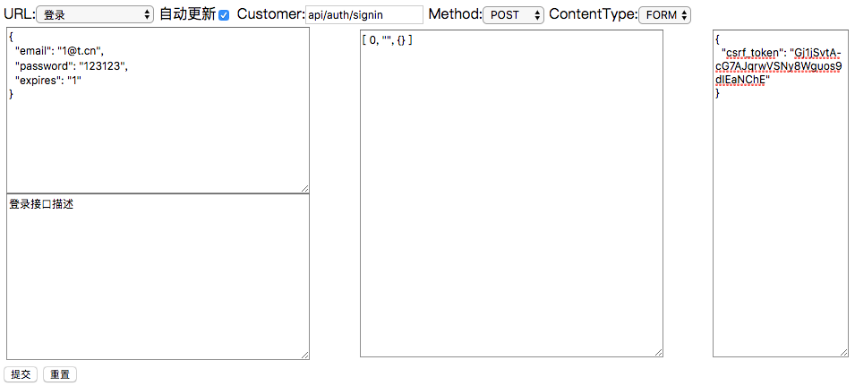

# api-gui
后端开发可视化接口测试


## Usage
拷贝`api.html`内容至项目入口页面，配置参数如下：

```js
curl({
  // 接口对象
}, {
  // 配置参数
},
  // 挂载节点
  document.querySelector('#app')
);
```

### 接口对象
```js
{
  // METHOD:API路径
  'POST:api/auth/signin': {
    default: true, // 默认选择
    title: '登录',
    desc: '接口描述',
    type: 'application/json', // content type
    // 前置接口（串行）
    serial: [
      [
        'api/todo', { method: 'GET', data: { q: 'value' } }, {
          // 将返回值 result.datum 自动复制到请求数据对象
          datum: true
        }
      ],
      [
        'api/test', { method: 'GET', data: { q: 'value' } }, {
          // 将返回值 result.datum.key1.key2... 自动复制到请求数据对象
          datum: ['key1', 'key2']
        }
      ],
      [
        'api/auth', { method: 'POST' }, function(data, result) {
          // 自定义处理返回数据并赋值（data）
          const encrypt = new JSEncrypt();
          encrypt.setPublicKey(result.key);
          data.password = encrypt.encrypt(data.password);
        }
      ]
    ],
    // 请求数据
    data: {
      email: '1@t.cn',
      password: '123123'
    }
  }
}
```

### 配置参数
```js
{
  scheme: [2], // 串行数据获取时主要数据key路径
  // 公用请求数据
  common: {
    header: {
      'X-CSRF-TOKEN': '<%= csrf_token %>' // 设置CSRF请求头
    },
    data: {}
  }
}
```


## 示例图
